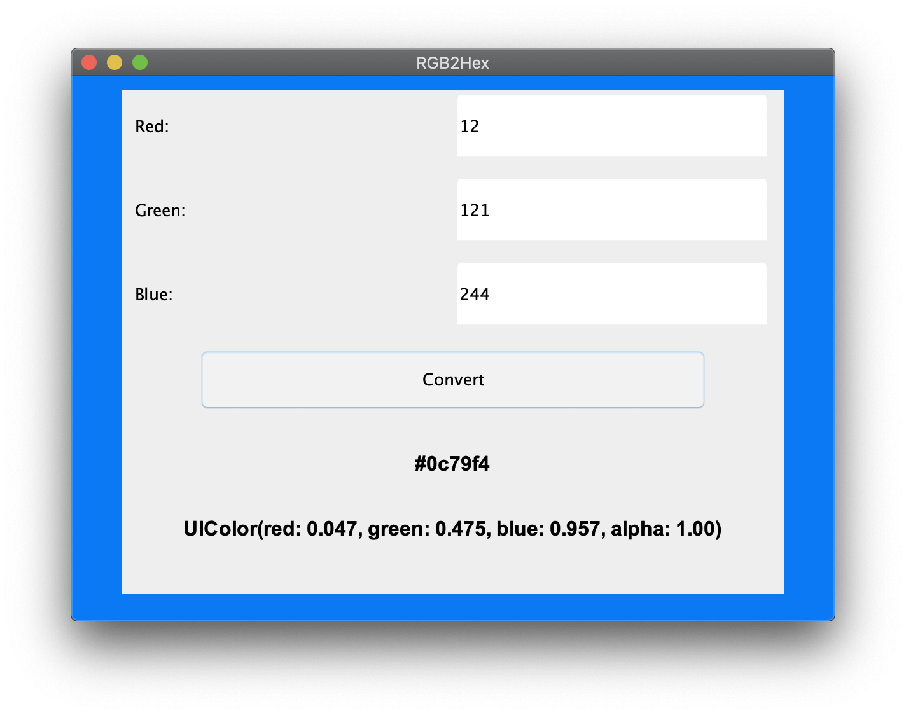

# RGB2Hex (Converter)
This is a simple GUI application that makes converting from RGB to Hexadecimal or UIColor easy. It was created using Java's Swing GUI framework. To run this on your local machine, make sure you have the latest version of Java installed on your computer. Then simply clone the project and run it on your favorite IDE. 

  

